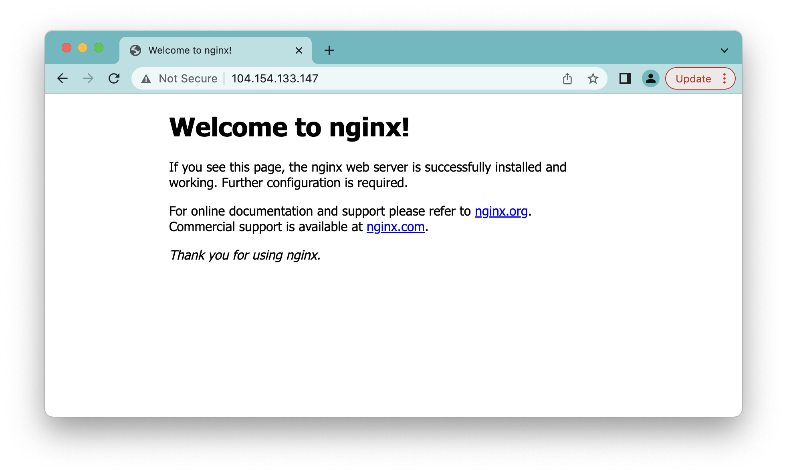

Workshop Walkthrough
=========================


Outline
--------

1. Using support bundles to summarize workload status 
2. Fixing resource problems / reviewing summary
3. Using support bundles to understand workload behvior
4. Providing feedback to end users to fix problems
5. Additional Challenges for the brave

[Video Recording](https://youtu.be/Syo5yAmHCVw?t=23043) | [Slides](https://docs.google.com/presentation/d/1gWLjNP-FxgMI9doKQkzM6P4uyfx8Awf5J69hyAmcajs/edit#slide=id.gac28e45d00_0_147)
 
Prerequisite: A Small K8s cluster
--------

A small Kubernetes cluster. For the CPU constraint logic to work as intended, a single-node cluster with 1 CPU core is recommended. Docker desktop or minikube are appropriate choices here. With GKE, you can accomplish this with:

```shell
export CLUSTER=dex-tiny-cluster
gcloud container clusters create $CLUSTER --machine-type=n1-standard-1 --no-enable-ip-alias  --num-nodes=1
```

Get your kubectl config for GKE with

```shell
gcloud container clusters get-credentials $CLUSTER
```

You can validate access with

```shell
kubectl get node
```

Prerequisite: Krew Package Manager for Kubectl
--------

Head over to [install krew.dev on your workstation](https://krew.sigs.k8s.io/docs/user-guide/setup/install/) to get the `kubectl krew` command working.
We'll use this later to install the `support-bundle` plugin.

 
Workshop Steps
------------

####  epilogue: cleaning up

If you started this workshop but are now coming back to it and want to start fresh, you can run the following. Note that this will delete everything running in your default namespace

```text
kubectl delete deploy,svc -n default -l app=my-app
kubectl delete ns load-ns
```

If you're using GKE and you scaled up your cluster, don't forget to scale it back down.


```shell
CLUSTER=dex-tiny-cluster
gcloud container clusters resize $CLUSTER --num-nodes=1
```

####  prologue: maxing out node CPU

Apply a dummy workload from this repo to max out node CPU to simulate a resource constraint.
Note: This is designed to use lots of CPU - use caution and don't deploy it to a production or autoscaling cluster!

```shell
kubectl apply -f supporting-materials/loader-pod.yaml
```

You should see

```text
namespace/load-ns created
deployment.apps/load-app created
```

If it's working, you should see CPU maxed out (note - not all clusters will support `kubectl top node`)

```text
$ kubectl top node
NAME                                              CPU(cores)   CPU%   MEMORY(bytes)   MEMORY%
gke-dex-tiny-cluster-default-pool-9dad0d7a-1m68   1000m        106%   915Mi           34%
```

#### prologue: deploying the app

Deploy the app that we're going to be troubleshooting today:

```shell
kubectl apply -f app-deployment.yaml
```


If you're so inclined, you can use the plain `kubectl` method to ensure things are broken as expected.

```shell
kubectl get pod
```

Should show

```text
NAME                     READY   STATUS    RESTARTS   AGE
my-app-9595cd9c7-4tpvx   0/1     Pending   0          3s
```

And you can use `kubectl describe pod my-app` to review in detail.

#### Collecting Cluster Resources

Now that we've got our app deployed and broken, we can start exploring the Troubleshoot.sh framework by adding our first [Collector](https://troubleshoot.sh/docs/collect/).

Using the docs at [Cluster Info](https://troubleshoot.sh/docs/collect/cluster-info/) and [Cluster Resources](https://troubleshoot.sh/docs/collect/cluster-resources/) let's create a simple spec to collect core cluster information.

```shell
cat <<EOF > support-bundle.yaml 
apiVersion: troubleshoot.sh/v1beta2
kind: SupportBundle
metadata:
  name: workshop
spec:
  collectors:
    - clusterInfo: {}
    - clusterResources:
        namespaces:
        - default
EOF
```

#### Installing the `support-bundle` CLI

Now that we have a simple spec, we can collect a support bundle.
We'll start by installing the `kubectl support-bundle` plugin.
This will require that you [install krew.dev on your workstation](https://krew.sigs.k8s.io/docs/user-guide/setup/install/)

```shell
kubectl krew install support-bundle
```

Check this is working with:

```shell
kubectl support-bundle version
```

This workshop is tested with

```text
Replicated Troubleshoot 0.42.0
```

#### Collecting a bundle

Now that we have `kubectl support-bundle` and our `support-bundle.yaml` file ready, we can collect a bundle. This won't output much useful info just yet, as we haven't added any analyzers - we'll get there soon.

```shell
kubectl support-bundle support-bundle.yaml
```

You should see a spinner and eventually a bundle path output. Ignore the output, you can untar tthe bundle to see the contents with 

```shell
tar xvf *.tar.gz
```

if you want to sort the output files with BSD tar, use

```text
tar xvf *.tar.gz 2>&1 | sort
```

you should see something like

```text
x support-bundle-2022-09-20T16_18_35/analysis.json
x support-bundle-2022-09-20T16_18_35/cluster-info/cluster_version.json
x support-bundle-2022-09-20T16_18_35/cluster-resources/auth-cani-list/default.json
x support-bundle-2022-09-20T16_18_35/cluster-resources/cronjobs/default.json
x support-bundle-2022-09-20T16_18_35/cluster-resources/custom-resource-definitions.json
x support-bundle-2022-09-20T16_18_35/cluster-resources/custom-resources/storagestates.migration.k8s.io.yaml
x support-bundle-2022-09-20T16_18_35/cluster-resources/custom-resources/storageversionmigrations.migration.k8s.io.yaml
x support-bundle-2022-09-20T16_18_35/cluster-resources/deployments/default.json
x support-bundle-2022-09-20T16_18_35/cluster-resources/events/default.json
x support-bundle-2022-09-20T16_18_35/cluster-resources/groups.json
x support-bundle-2022-09-20T16_18_35/cluster-resources/ingress/default.json
x support-bundle-2022-09-20T16_18_35/cluster-resources/jobs/default.json
x support-bundle-2022-09-20T16_18_35/cluster-resources/limitranges/default.json
x support-bundle-2022-09-20T16_18_35/cluster-resources/namespaces.json
x support-bundle-2022-09-20T16_18_35/cluster-resources/network-policy/default.json
x support-bundle-2022-09-20T16_18_35/cluster-resources/nodes.json
x support-bundle-2022-09-20T16_18_35/cluster-resources/pod-disruption-budgets/default.json
x support-bundle-2022-09-20T16_18_35/cluster-resources/pods/default.json
x support-bundle-2022-09-20T16_18_35/cluster-resources/pods/logs/default/my-app-9595cd9c7-4tpvx/my-app-previous.log
x support-bundle-2022-09-20T16_18_35/cluster-resources/pods/logs/default/my-app-9595cd9c7-4tpvx/my-app.log
x support-bundle-2022-09-20T16_18_35/cluster-resources/pvcs/default.json
x support-bundle-2022-09-20T16_18_35/cluster-resources/pvs.json
x support-bundle-2022-09-20T16_18_35/cluster-resources/replicasets/default.json
x support-bundle-2022-09-20T16_18_35/cluster-resources/resources.json
x support-bundle-2022-09-20T16_18_35/cluster-resources/services/default.json
x support-bundle-2022-09-20T16_18_35/cluster-resources/statefulsets/default.json
x support-bundle-2022-09-20T16_18_35/cluster-resources/storage-classes.json
x support-bundle-2022-09-20T16_18_35/version.yaml
```

#### What's in a bundle - Deployments

That's a lot of cluster info out of one command. 
Feel free to peruse what's here but we'll start by reviewing what's available in the `deployments/default.json` file.

```shell
cat */cluster-resources/deployments/default.json | jq '.items[] | .status'
```

if you don't have `jq` handy, you can also use `tail`

```shell
tail -n 30 */cluster-resources/deployments/default.json
```

in either case, you should see some useful information near the top 

```yaml
{
  #...
  "status": {
    "observedGeneration": 1,
    "replicas": 1,
    "updatedReplicas": 1,
    "unavailableReplicas": 1,
    # ...
  }
}
```


#### Using analyzers to summarize deployment info

Whether it's `kubectl get pod` or examining the raw json, troubleshoot.sh can give us a better way to summarize deployment info. 
Following the docs at [Deployment Status](https://troubleshoot.sh/docs/analyze/deployment-status/), let's add the following to the end of our `support-bundle.yaml`:

```text
cat <<EOF >>support-bundle.yaml
  analyzers:
    - deploymentStatus:
        checkName: Deployment Status
        name: my-app
        namespace: default
        outcomes:
          - fail:
              when: "< 1"
              message: No ready replicas
          - pass:
              when: "= 1"
              message: At least one replica is ready
EOF
```

Now test it with 

```
kubectl support-bundle support-bundle.yaml
```

You should see some helpful information displayed once the bundle is finished analyzing: 


#### What's in a bundle - pod statuses

The deployment status is a great high-level indicator that something's going wrong, but it doesn't give us a ton of insight into **why**. For that we'll have to dig into pod statuses. Using the same bundle we unpacked earlier, let's have a look at the output of

```shell
tail -n 30 */cluster-resources/pods/default.json
```

You should see some more detail here, including the important `1 Insufficient cpu` feedback.

```yaml
# ...
"status": {
  "phase": "Pending",
  "conditions": [
    {
      "type": "PodScheduled",
      "status": "False",
      "lastProbeTime": null,
      "lastTransitionTime": "2022-09-20T18:27:38Z",
      "reason": "Unschedulable",
      "message": "0/1 nodes are available: 1 Insufficient cpu."
    }
  ]
# ...
```

> **Aside -- iterating and cleaning up old bundles**
>
> As you progress through this lab, you'll notice quite a few `.tar.gz` files and their contained directories will start to pile up in your working directory.
> There is a `make clean` command available that will help you clean these up as you go.
> You should try running it now--you can verify your working directory is cleaned up with `ls`.

```shell
make clean
```

```shell
ls
```

#### Analyzing pod statuses

Now that we have explored the raw data in the bundle, let's follow the instructions in [Cluster Pod Statuses](https://troubleshoot.sh/docs/analyze/cluster-pod-statuses/) to add some logic to detect this:

```shell
cat <<EOF >>support-bundle.yaml
    - clusterPodStatuses:
        name: unhealthy
        namespaces:
          - default
        outcomes:
          - fail:
              when: "= Pending"
              message: 'Pod {{ .Name }} is unhealthy with a status of {{ .Status.Reason }}: {{ range .Status.Conditions }}{{.Reason}} -- {{.Message}}{{end}}'
          - fail:
              when: "!= Healthy"
              message: 'Pod {{ .Name }} is unhealthy with a status of {{ .Status.Reason }}'
EOF
```

Now test it with 

```shell
kubectl support-bundle support-bundle.yaml
```

Using the arrow keys to navigate, you should see the pod failure reason surfaced in an analyzer.


#### Fixing the environment 

Now that we know what's wrong, lets fix our environment.
There are two ways to do this

1. If you really want to simulate a real-world scenario where more resources are required, scale up your cluster
   1. For GKE, you can do this with `CLUSTER=dex-tiny-cluster; gcloud container clusters resize $CLUSTER --num-nodes=2`
2. If adding another node is difficult (e.g. Minikube or Docker Desktop), you can also get away with deleting the workload that's hogging all our CPU 
   1. `kubectl delete ns load-ns`

Once you've done this, resist the urge to run `kubectl get pod` (I know, it's hard).
Let's re-run our same analyzer:

```shell
kubectl support-bundle support-bundle.yaml
```

You should see some new info:


Progress, but things still arent working. 


Looks like our pod was scheduled now, but it's in CrashLoopBackoff.

#### Digging Deeper: Collecting Pod Logs

The default next step would probably be to check the pod logs to see what's going on, but troubleshoot.sh can solve that as well.
 
> **Aside -- iterating on bundle specs**
>
> Simliar to the `make clean` command noted above, there's a handy
> `make iterate` command that will, in order:
> 
> 1. clean up old bundles and directories (as in `make clean`)
> 2. run `vim support-bundle.yaml`
> 3. run `kubectl support-bundle support-bundle.yaml`
> 4. run `tar xvf *.tar.gz` to untar the local bundle so you can see the contents
> 
> If you are comfortable editing yaml files from the command line, you may find this workflow helps you iterate faster.
 

Following the [Pod Logs](https://troubleshoot.sh/docs/collect/logs/) documentation, add the following to your support bundle spec under the `collectors` section.

```diff
 spec:
   collectors:
     - clusterInfo: {}
     - clusterResources:
        namespaces:
          - default
+    - logs:
+       name: pod-logs
+       selector:
+         - app=my-app
   analyzers:
     - deploymentStatus:
         checkName: Deployment Status
```

now lets collect a bundle

```shell
kubectl support-bundle support-bundle.yaml
```

and untar it

```shell
tar xvf *.tar.gz
```

You should see a few new entries in the ouput

```
x support-bundle-2022-09-19T19_41_59/pod-logs/my-app-59b8d785c7-wrv5s-previous.log
x support-bundle-2022-09-19T19_41_59/pod-logs/my-app-59b8d785c7-wrv5s.log
```

while we now have the logs and could search for the error with standard tools like `grep`, let's add an analyzer to find the log line we're looking for.

#### Analyzing Pod Logs

Let's add an analyzer to look for the log line we care about - in this case we'll search for a log line looking like 

```text
ERROR 
``` 

Following the docs in [Regex Analyze](), add the following to your file and run `kubectl support-bundle` again.

```shell
cat <<EOF >>support-bundle.yaml
    - textAnalyze:
        checkName: No Errors in Logs
        fileName: pod-logs/*.log
        regex: 'prevent-start'
        outcomes:
          - pass:
              when: "false"
              message: "No concerning logs found"
          - fail:
              when: "true"
              message: |
                There's an error in startup -- if you forgot to prevent preventing starting, try removing the 'com.example.myapp/prevent-start' annotation
EOF
```

You should see the following, suggesting that we may have misconfigured our application :grimacing:


> **Aside -- Why are there two of the same analzyer?**
>
> You may notice in the screenshot above, that there are 
> two instances of the analyzer. This is due to collecting both
> the current and `-previous` logs of the service, as would be returned by
> `kubectl logs` and `kubectl logs -p`
> 
> Feel free to follow this issue for updates on this: https://github.com/replicatedhq/troubleshoot/issues/732


#### Adding a URI to help our users


Okay last step, let's add a URI so that users can get help with the detected problem:

```shell
cat <<EOF >>support-bundle.yaml
              uri: https://github.com/dexhorthy/k8s-troubleshoot-workshop/blob/main/patching-prevent-start.md
EOF
```

```shell
kubectl support-bundle support-bundle.yaml
```

You should see something like the following. Because of a [known issue](https://github.com/replicatedhq/troubleshoot/issues/733), you may have to resize your window to see the URL (I know I did :slightly_smiling_face:)


#### Fixing the pod and viewing the app

Following the instructions at [the documentation URL we added](https://github.com/dexhorthy/k8s-troubleshoot-workshop/blob/main/patching-prevent-start.md), let's patch the pod to remove that pesky `prevent-start` annotation:

```shell
kubectl patch deployment my-app -p '{"spec": {"template": {"metadata": {"annotations": {"com.example.myapp/prevent-start": ""}}}}}'
```

Now, running a support bundle should give you a clean report:

```shell
kubectl support-bundle support-bundle.yaml
```


and you should be able to open the service. This will be k8s-cluster dependent -- on GKE we use `kubectl get service` to view the `LoadBalancer` IP.

```text
└> kubectl get svc
NAME         TYPE           CLUSTER-IP      EXTERNAL-IP       PORT(S)        AGE
kubernetes   ClusterIP      10.159.240.1    <none>            443/TCP        34h
my-app       LoadBalancer   10.159.247.34   104.154.133.147   80:30533/TCP   31h
```




#### Exercise for the workshop -- test with a url spec

Troubleshoot.sh specs don't have to be hosted locally -- you can also host them on the web somewhere:

```shell
kubectl support-bundle https://raw.githubusercontent.com/dexhorthy/k8s-troubleshoot-workshop/main/support-bundle-final.yaml
```


#### Exercise for the workshop -- inspecting without logs

Can you add collectors and analyzers that inspect the `prevent-start` annotation without reading the logs?

<details>
  <summary>Expand for a hint</summary>
Try exploring the [JSONCompare](https://troubleshoot.sh/docs/analyze/json-compare/) or [YAMLCompare](https://troubleshoot.sh/docs/analyze/yaml-compare/) analyzers.
</details>


#### Exercise for the workshop -- checking web content 

A good sanity check for any webserver is to see if it's (whoops!) serving the default nginx content (which our example app happens to do). 

Can you modify your support-bundle.yaml to detect if we have a webserver that's serving a default 'Welcome to nginx' page?

<details>
  <summary>Expand for a hint</summary>
Try exploring the [Exec Pod](https://troubleshoot.sh/docs/collect/exec/), [Copy File](https://troubleshoot.sh/docs/collect/copy/) or [HTTPRequest](https://troubleshoot.sh/docs/collect/http/) collectors with a [Regular Expression](https://troubleshoot.sh/docs/analyze/regex/) analyzer.
</details>
